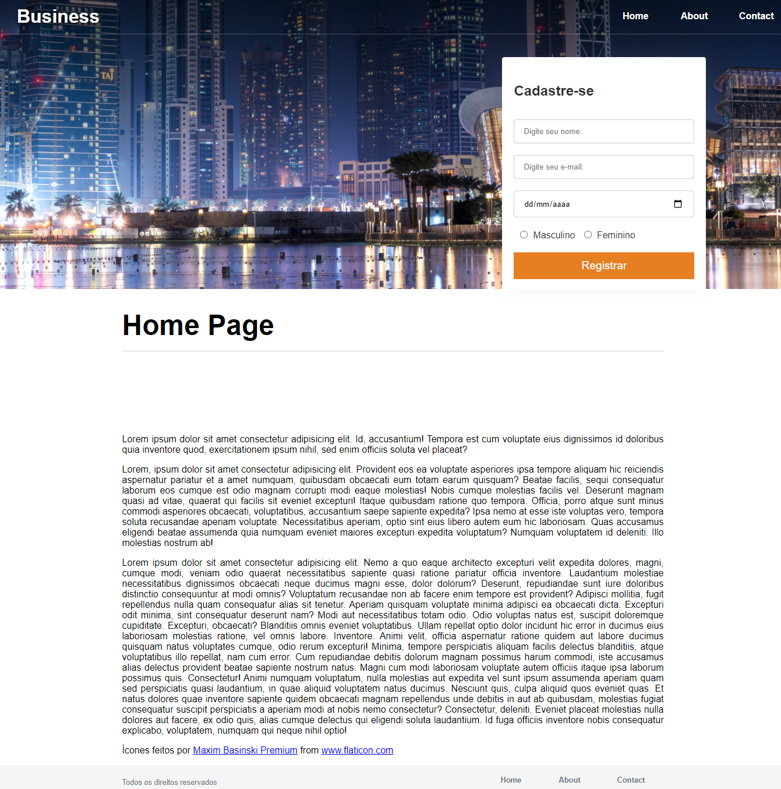

# Business

## Sobre o projeto.
Site responsivo desenvolvido para se adequar a telas abaixo de 450 pixels. Com menu e campo de cadastro. campo menu com degradê leve em tom de preto de cima para baixo.<br><br>
Data de conclusão: 28/10/2021<br><br>
## Ferramentas e tecnologias usadas nesse projeto.
```js    
function Business(Project) {
    const FrontEnd = `${HTML}, ${CSS}, ${JavaScript}`;
};

``` 
<br>

<div align="center">



</div>

---

> - Autores: 
>   - [Eduardo Kayke](https://github.com/EduardoKayke "Perfil do Eduardo")

- [Voltar ao perfil do Github.](https://github.com/EduardoKayke "Perfil do Eduardo")

_Um dia seremos a tecnologia. Biohacking a própria evolução de nós mesmos._
